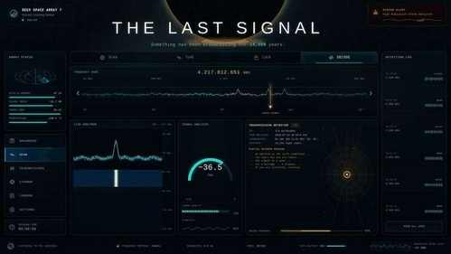

# THE LAST SIGNAL

> Something has been broadcasting for 14,000 years.

**The Last Signal** is a cinematic deep-space signal hunting experience. Tune a logarithmic receiver, isolate coherent carriers, lock transmissions, decode fragments, and build a persistent archive of discoveries.



## Live experience

The production Vercel URL will be added after the first deployment.

## Core systems

- Logarithmic 10 MHz to 100 GHz frequency tuner
- Pointer, wheel, keyboard, and touch controls
- Procedural real-time spectrum, waterfall, stability, radar, and noise canvases
- Web Audio static and dynamic carrier tones
- Deterministic serverless signal catalogue
- Server-validated progressive decoding
- Persistent local receiver state and discovery archive
- Responsive desktop, tablet, and mobile layouts
- Reduced-motion and audio controls
- Zero runtime package dependencies

## Architecture

```text
.
├── api/
│   ├── decode.js
│   ├── session.js
│   └── signals.js
├── public/
│   └── favicon.svg
├── scripts/
│   └── check.mjs
├── src/
│   ├── app.js
│   ├── styles.css
│   └── modules/
│       ├── api-client.js
│       ├── audio-engine.js
│       ├── config.js
│       ├── signal-engine.js
│       ├── spectrum-renderer.js
│       ├── starfield.js
│       └── store.js
├── dev-server.mjs
├── index.html
├── package.json
└── vercel.json
```

## Local development

```bash
npm run dev
```

Open `http://127.0.0.1:4173`.

## Validation

```bash
npm run check
```

## Deployment

The repository is configured for Vercel static hosting plus Node.js serverless functions. No build step or package installation is required.

## Controls

- Drag across the frequency band to tune.
- Use the mouse wheel or arrow keys for precise tuning.
- Select **Scan** for automatic hopping.
- Select **Lock** near a coherent carrier.
- Select **Decode** after a successful lock.

## License

Apache License 2.0 © 2026 Satyajit Beura
